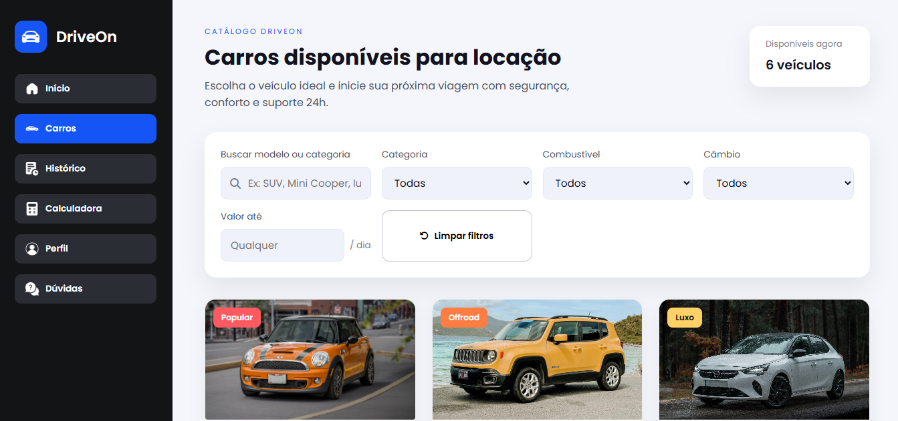

# 🚗 DriveOn – Sistema de Locação de Veículos

## 📌 Sobre o Projeto

O **DriveOn** é um sistema web desenvolvido para **gestão e locação de veículos**, com foco em simplicidade, organização e eficiência. Ele permite que empresas de aluguel de carros controlem sua frota, clientes e contratos de locação de forma centralizada e intuitiva.

Este projeto foi idealizado para atender **locadoras de pequeno, médio e grande porte**, automatizando processos que normalmente são feitos de forma manual.

---

## 🎯 Objetivo

O objetivo principal do **DriveOn** é:

* Automatizar o processo de locação de veículos
* Facilitar o gerenciamento da frota
* Reduzir erros operacionais
* Melhorar o controle administrativo e financeiro

---

## 👥 Público-Alvo

* Empresas de locação de veículos
* Gestores de frota
* Atendentes administrativos
* Pequenas e médias locadoras

---

## ⚙️ Funcionalidades

### 🚙 Gestão de Veículos

* Cadastro de veículos (modelo, placa, categoria, preço, status)
* Visualização da frota
* Controle de status (Disponível, Alugado, Manutenção)

### 👤 Gestão de Clientes

* Cadastro de clientes
* Armazenamento de dados básicos
* Histórico de locações

### 📄 Gestão de Locações

* Criação de contratos de locação
* Definição do período de aluguel
* Cálculo automático de valores
* Associação entre cliente e veículo

### 📊 Relatórios e Controle

* Listagem de veículos disponíveis e alugados
* Histórico de locações
* Controle básico de faturamento

---

## 🛠️ Tecnologias Utilizadas

### Front-end

* HTML5
* CSS3
* JavaScript
* Bootstrap

### Back-end

* Node.js
* Express

### Banco de Dados

* MySQL

> As tecnologias podem variar conforme a evolução do projeto.

---

## 📂 Estrutura do Projeto (Exemplo)

```bash
DriveOn/
├── backend/
│   ├── controllers/
│   ├── routes/
│   ├── models/
│   └── server.js
├── frontend/
│   ├── assets/
│   ├── pages/
│   └── index.html
└── README.md
```

---

## 🖼️ Telas do Sistema

### 🔐 Área Administrativa – Gestão de Veículos

Nesta área, o **administrador** tem controle total sobre a frota de veículos, podendo cadastrar, editar, remover e acompanhar o status de cada carro.

**Funcionalidades do Admin:**

* Cadastro de novos veículos
* Edição de informações (modelo, placa, preço, status)
* Visualização da frota completa
* Controle de disponibilidade e manutenção

📸 *Exemplo de tela – Gestão de Veículos (Admin)*


---

### 👤 Área do Cliente – Visualização e Locação de Veículos

Nesta área, o **cliente** pode visualizar os veículos disponíveis para locação, consultar detalhes e realizar o processo de aluguel de forma simples e intuitiva.

**Funcionalidades do Cliente:**

* Visualização dos veículos disponíveis
* Consulta de detalhes do carro
* Seleção do período de locação
* Solicitação de aluguel

📸 *Exemplo de tela – Lista de Veículos (Cliente)*



---

## 🚀 Benefícios do Sistema

* Organização centralizada
* Agilidade nos processos
* Melhor controle da frota
* Facilidade de uso
* Escalável para crescimento futuro

---

## 📌 Status do Projeto

🚧 Em desenvolvimento / Protótipo funcional

---

## 📄 Licença

Este projeto está sob a licença **MIT**.

---

## ✨ Considerações Finais

O **DriveOn** é uma solução moderna para empresas que desejam profissionalizar o processo de locação de veículos, oferecendo controle, praticidade e eficiência em um único sistema.
